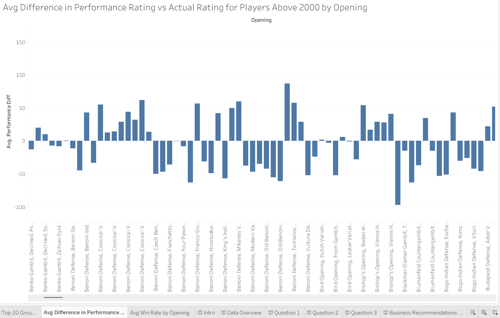

# chess-openings-data-analytics-project
In this data analytics project, I analyzed a chess openings dataset and answered four critical questions to help chess companies determine how to expend their resources on chess openings.

#Overview
This project seeks to understand and analyze the chess openings that tend to perform best, win rates by openings, whether performance and win rates correlate strongly enough to be perceived as interchangeable, and if white has a statistically significant advantage over black in many chess openings. This data matters as it will help companies reduce the amount of resources they expend on chess openings and instead focusing on openings that produce the best results. This not only benefits companies but also helps chess players/customers focus on better resources.

#Process
I used four different data sets containing variables for appropriate analysis. I additionally included a feature engineered variable named 'Performance Difference.' This variable is to analyze the difference in performance vs actual rating in players above 2000 to discern what openings perform the best at the highest levels. Limitation/Challenge - I don't know if the data set relied on official FIDE ratings or online ratings and nor do I know the exact time format that these ratings arose from. I cleaned up misspellings and excluded extremely old groups in the data set to ensure the data was up to date.

#Key Findings/Answers to Questions
Question 1 - What Openings Produce the Strongest Performance Levels? - Latvian Gambit, Torre Attack, Centre Game, Italian Game (openings which tend to control the centre and allow for ease of development). Weakest - Slav, sicilian, Nimzo-Indian. These tend to be either extremely passive or too aggressive. This can also be seen in the openings vs difference in performance rating and actual rating graph.
Question 2 - What Openings Produce the Highest Win Rate. Are Win Rates and Performance Levels Interchangeable? - Exactly like performance rating, we can tell from the data set that there are very similar findings for performance levels and win rates. Latvian Gambit, Torre Attack, Centre Game, Italian Game (openings which tend to control the centre and allow for ease of development). Weakest - Slav, sicilian, Nimzo-Indian. These tend to be either extremely passive or too aggressive. From the collected information, we can discern that higher win rates translate well with stronger performance and beating higher rated players potentially (not only beating weaker players as this is what performance rating heavily depends upon although with caveats - beating weaker players can still produce a performance rating above actual rating) in the dataset. Does the feature engineered variable performance level truly correlate strongly with win percentage? Yes, there is a strong correlation of r = 0.73 with a p value < 0.001 according to my analysis of the data even though the feature engineered variable only includes groups with average ratings above 2000. This can also be seen in the opening vs win rate graph. One caveat is that this is because the rating for groups under 2000 are still very close to 2000, so this is why this holds.
Question 3 - Is there a strong white advantage over black in many openings in the dataset? - Yes, there is a statistically significant higher win rate. T-value greater than 2 (I received a T-value of 7 which is extremely high and positive in favor of white) and the p-value was less than 0.001 as per my analysis. This can also be seen in the top 20 win rate graphs for the white pieces and black pieces.

#Dashboard

#Skills Demonstrated
- Cleaned up data using python pandas
- Data visualization using Excel and Tableau
- Feature Engineering
- Data Analysis
- Dashboard development
